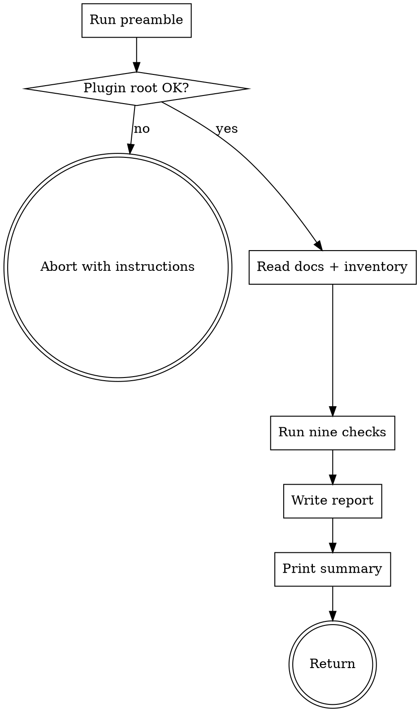

# check-consistency

Scan ytstack's own repo for drift between its docs (README, concept, DECISIONS, QUICKSTART, CLAUDE.md) and its implementation (skills, hooks, artifacts). Emit one structured report at `.ytstack/CONSISTENCY-REPORT.md`.

README.md is the authoritative source of truth; every other file is compared against it. When a skill, hook, or workflow is mentioned in a doc but does not exist on disk -- or when it exists on disk but no doc references it -- this skill surfaces the gap. It does not silently fix either side.

## Anti-Pattern: "docs look fine, skip the audit"

Doc drift accumulates silently: a skill gets renamed, a hook is added for a hotfix, a README bullet is written aspirationally ahead of the code, a concept paper is generated in one session and forgotten in the next. By the time an end-to-end smoke-test reveals the mismatch, the agent has been primed with false claims for weeks. This skill runs in seconds. Run it.

## Checklist

You MUST create a TodoWrite task for each item and complete them in order:

1. Run preamble -- locate the plugin root and collect on-disk inventory
2. HARD-GATE -- abort if the plugin root is missing core files
3. Read authoritative docs -- README.md, QUICKSTART.md, CLAUDE.md, docs/concept.md, docs/methodology.md, .ytstack/DECISIONS.md
4. Read implementation inventory -- skills/, hooks/hooks.json, agents/, bin/
5. Run the nine consistency checks (below)
6. Emit the report to `.ytstack/CONSISTENCY-REPORT.md`
7. Print a one-screen summary of findings to the user
8. Return control -- do NOT auto-fix anything

## Process Flow



## Preamble

```bash
_PLUGIN_ROOT="${CLAUDE_PROJECT_DIR:-$PWD}"
cd "$_PLUGIN_ROOT" 2>/dev/null || { echo "ERR: cannot enter plugin root $_PLUGIN_ROOT"; exit 1; }

_HAS_README=$([ -f README.md ] && echo yes || echo no)
_HAS_CONCEPT=$([ -f docs/concept.md ] && echo yes || echo no)
_HAS_DECISIONS=$([ -f .ytstack/DECISIONS.md ] && echo yes || echo no)
_HAS_QUICKSTART=$([ -f QUICKSTART.md ] && echo yes || echo no)
_HAS_CLAUDE_MD=$([ -f CLAUDE.md ] && echo yes || echo no)
_HAS_HOOKS_JSON=$([ -f hooks/hooks.json ] && echo yes || echo no)
_HAS_WRITING_STYLE=$([ -f docs/ux/writing-style.md ] && echo yes || echo no)

_SKILLS_ON_DISK=$(ls -d skills/*/ 2>/dev/null | sed 's|skills/||;s|/$||' | sort)
_SKILL_COUNT=$(echo "$_SKILLS_ON_DISK" | grep -c . || echo 0)
_HOOK_FILES=$(ls hooks/ 2>/dev/null | grep -v '^hooks\.json$' | sort)
_HOOK_COUNT=$(echo "$_HOOK_FILES" | grep -c . || echo 0)

_TIMESTAMP=$(date -u +%Y-%m-%dT%H:%M:%SZ)
_REPORT_PATH="$_PLUGIN_ROOT/.ytstack/CONSISTENCY-REPORT.md"

echo "PLUGIN_ROOT: $_PLUGIN_ROOT"
echo "HAS_README: $_HAS_README"
echo "HAS_CONCEPT: $_HAS_CONCEPT"
echo "HAS_DECISIONS: $_HAS_DECISIONS"
echo "HAS_QUICKSTART: $_HAS_QUICKSTART"
echo "HAS_CLAUDE_MD: $_HAS_CLAUDE_MD"
echo "HAS_HOOKS_JSON: $_HAS_HOOKS_JSON"
echo "HAS_WRITING_STYLE: $_HAS_WRITING_STYLE"
echo "SKILL_COUNT: $_SKILL_COUNT"
echo "HOOK_COUNT: $_HOOK_COUNT"
echo "TIMESTAMP: $_TIMESTAMP"
echo "REPORT_PATH: $_REPORT_PATH"
echo "--- skills on disk ---"
echo "$_SKILLS_ON_DISK"
echo "--- hook files ---"
echo "$_HOOK_FILES"
```

## Procedure

### Step 2: HARD-GATE

If `HAS_README=no` OR `HAS_CONCEPT=no` OR `HAS_DECISIONS=no` OR `HAS_HOOKS_JSON=no` -- abort with:

> "check-consistency requires README.md, docs/concept.md, .ytstack/DECISIONS.md, and hooks/hooks.json. Missing one of these means either the working directory is wrong or ytstack's own scaffolding is broken. Fix that first, then re-run."

### Step 3: Read authoritative docs

Use the Read tool to load into working memory:

- `README.md` (full)
- `QUICKSTART.md` (full, if present)
- `CLAUDE.md` (full)
- `docs/concept.md` (full)
- `docs/methodology.md` (full)
- `.ytstack/DECISIONS.md` (full)
- `docs/ux/writing-style.md` (full, for banned-words list)

### Step 4: Read implementation inventory

For every directory in `_SKILLS_ON_DISK`, Read `skills/<name>/SKILL.md` frontmatter (name + description + triggers fields). Record in memory.

Read `hooks/hooks.json` (full).

Read `skills/using-ytstack/SKILL.md` (full) -- the trigger map is there.

### Step 5: Run the nine consistency checks

For each check, record: check name, result (PASS / WARN / FAIL), findings list.

#### Check 1: Skill count drift

- Authoritative count: parse README §Status ("Ships: N skills ...") and extract N.
- Actual count: `_SKILL_COUNT` from preamble.
- If N != actual: WARN. Findings: "README claims N skills, disk has M."

#### Check 2: Wrapped-skill claims vs on-disk

- From `docs/concept.md` §3.1 table, extract the list of wrapped skill names.
- For each, verify `skills/<name>/SKILL.md` exists. Missing -> FAIL.
- From the README comparison table (the markdown table under §"Compared to using each framework alone"), cross-check each "via wrapper" row resolves to a skill that exists. Missing -> FAIL.

#### Check 3: Native-skill claims vs on-disk

- From `docs/concept.md` §3.4 native-skill list, verify every named skill exists in `skills/`.
- Missing -> FAIL. Extra on disk but not in §3.4 -> WARN "undocumented native skill".

#### Check 4: Explicit-skip claims

- README §"ytstack is the curation" text: regex-extract any skill names called out as "duplicates" or "conflicts with" or "skipped".
- Cross-check with `docs/concept.md` §3.2 table rows. Each README-skip must have a corresponding §3.2 row. Each §3.2 row must cite README. Mismatch -> WARN.

#### Check 5: Trigger-map vs README natural-language examples

- From `skills/using-ytstack/SKILL.md`, parse the trigger map table (markdown table under "Trigger map").
- From `README.md` §"What a session feels like", parse the bulleted "Say X -> skill Y" examples.
- Every README phrase must appear in the trigger map (or a close semantic equivalent). Missing -> WARN.
- Every trigger-map skill must exist in `skills/`. Missing skill -> FAIL.

#### Check 6: Hook inventory

- From `hooks/hooks.json`, list every registered hook.
- From `_HOOK_FILES`, list every script file in `hooks/`.
- Each JSON-registered hook must have a matching script file (or vice versa). Mismatch -> FAIL.
- `docs/concept.md` §3.4 hook list must include all 8 hooks (or whatever the actual count is). Drift -> WARN.

#### Check 7: Artifact list vs init-project

- From `docs/concept.md` §3.4 artifact list, extract the six-file list (PROJECT / DECISIONS / KNOWLEDGE / STATE / RUNTIME / PREFERENCES).
- Grep `skills/init-project/SKILL.md` for actual Write-tool templates. Each named artifact must have a template in init-project. Missing -> FAIL.

#### Check 8: Workflow skill references

- From `docs/concept.md` §5 (all three workflows), extract every ytstack skill name mentioned.
- Each name must resolve to `skills/<name>/`. Dangling reference -> FAIL.
- From `QUICKSTART.md` do the same.

#### Check 9: Banned words

- From `docs/ux/writing-style.md`, extract the banned-word list.
- Grep `README.md`, `docs/concept.md`, `QUICKSTART.md`, `CLAUDE.md`, `.ytstack/PROJECT.md` for each banned word (word-boundary, case-insensitive).
- Any hit -> WARN with the line reference.
- Also grep for literal em-dash character (`—`, U+2014) outside of meta-reference files (`docs/ux/writing-style.md`, `.ytstack/KNOWLEDGE.md`, `.ytstack/REVIEW-NOTES.md`). Hits -> WARN.

### Step 6: Emit the report

Write `.ytstack/CONSISTENCY-REPORT.md` with this structure:

```markdown
---
generated: {TIMESTAMP}
generator: ytstack:check-consistency v0.1.0
authoritative_source: README.md
---

# ytstack Consistency Report

## Summary

- Total checks: 9
- PASS: N
- WARN: N
- FAIL: N
- Overall: OK | DRIFT DETECTED | BLOCKED

## Check 1: Skill count drift

Status: PASS | WARN | FAIL

Findings:
- <bullet>
- <bullet>

(... one section per check ...)

## Actions suggested (human decides)

For each FAIL / WARN, a suggested reconciliation path. Do NOT auto-apply.

<list>

## Next steps

- Review this report
- Pick reconciliations
- For any architectural resolution, land a DECISIONS entry BEFORE editing docs or code
- Re-run `/ytstack:check-consistency` after reconciliation to verify
```

### Step 7: Print a one-screen summary

To the user, print:

> check-consistency run at {TIMESTAMP}. Report: `.ytstack/CONSISTENCY-REPORT.md`
>
> - {N} PASS
> - {N} WARN
> - {N} FAIL
>
> Top findings (first 3 FAILs or top 3 WARNs if no FAILs):
> 1. {finding}
> 2. {finding}
> 3. {finding}
>
> Overall: {OK | DRIFT DETECTED | BLOCKED}. Open the report for the full list.

### Step 8: Return control

Do NOT auto-invoke any reconciliation skill. Do NOT edit README, concept.md, DECISIONS.md, or any SKILL.md. The report is a reading surface; the human chooses what to fix and files the DECISIONS entries.

## Terminal State

Return after writing the report and printing the summary. Valid next actions:

- User reviews the report
- User reconciles specific findings with explicit edits + DECISIONS entries
- User re-runs this skill to verify

Do NOT invoke `/ytstack:plan-milestone`, `/ytstack:plan-task`, or any other skill from here.

## Why no auto-fix

Each drift finding could be caused by (a) a doc lagging behind code, (b) code lagging behind an approved doc change, or (c) an aspirational doc that was never going to ship as written. The skill cannot tell which. Auto-fixing either side without human judgment risks deleting work or silently locking in the wrong direction. Report-only, always.
