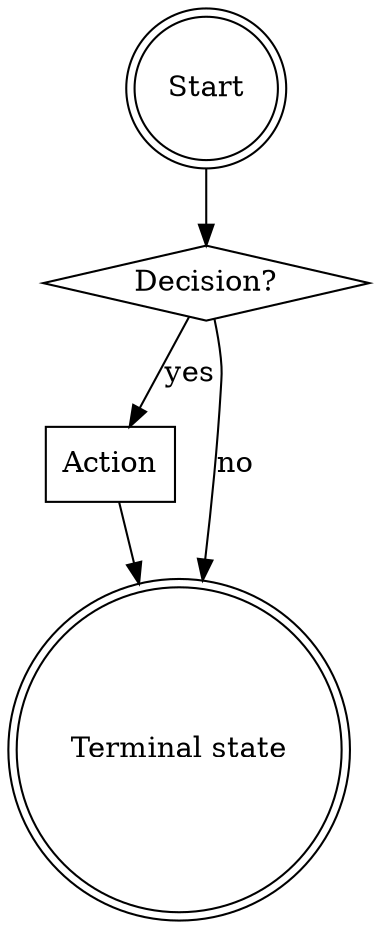

# ytstack Skill Structure

Every ytstack skill (`skills/*/SKILL.md`) MUST follow this structure. CI validates it. Skills that fail validation are not shipped.

## Required sections, in order

```
---
<frontmatter>
---

<HARD-GATE>         (optional but recommended)
<Anti-Pattern>       (optional but recommended)

## Checklist         (required)

## Process Flow      (required for non-trivial skills)

## Preamble          (required)

## The Procedure     (required -- main body)

## Terminal State    (required)
```

## Frontmatter

Required fields:

```yaml
---
name: <skill-name>              # kebab-case, matches folder name
description: <one-sentence>     # trigger description, see writing-style.md
tier: core|task|background      # Kontext-Pyramide tier
version: 1.0.0                  # semver
allowed-tools:                  # explicit allowlist
  - Bash
  - Read
  - Edit
  - AskUserQuestion
---
```

## HARD-GATE (pre-empt premature action)

Use when the skill must block downstream actions until a prerequisite is met:

```xml
<HARD-GATE>
Do NOT <action A>, <action B>, or <action C> until <prerequisite>.
This applies to EVERY <situation> regardless of perceived <quality>.
</HARD-GATE>
```

Example (from `init-project`):

```xml
<HARD-GATE>
Do NOT invoke any milestone-planning skill, create `.ytstack/M*-*.md` files,
or spawn an agent team until `.ytstack/PROJECT.md` exists and the user has
confirmed its content. This applies to EVERY project regardless of perceived
simplicity.
</HARD-GATE>
```

## Anti-Pattern Preemption (kill rationalization)

Use when there's a predictable "this is too simple to bother" pattern the agent might rationalize:

```markdown
## Anti-Pattern: "<the rationalization>"

<one paragraph explaining why the rationalization is wrong>

<what to do instead>
```

Example (from `plan-milestone`):

```markdown
## Anti-Pattern: "This feature is too small for a full milestone"

Every feature goes through this process. A CSS tweak, a single bugfix, a config
change -- all of them. "Small" features are where unexamined assumptions cause
the most wasted work. The milestone can be minimal (one slice, two tasks), but
you MUST create it and get approval.
```

## Checklist

Every skill has a numbered checklist. The skill MUST instruct the agent to create a TodoWrite task for each item and complete them in order.

Template:

```markdown
## Checklist

You MUST create a task for each of these items and complete them in order:

1. **<step name>** -- <one-line description>
2. **<step name>** -- <one-line description>
3. ...
```

Rules:
- Each item is an observable action (file written, tool called, user asked)
- No item is "think about X" -- observable outcomes only
- Items that are conditional (only run if Y) are explicit: "**<step>** (only if `FLAG=yes`)"

## Process Flow

For skills with non-trivial branching, include a `dot` graph. Use box for actions, diamond for decisions, doublecircle for terminal states.

Template:

````markdown
## Process Flow


````

Keep it under ~15 nodes. If it's more complex, decompose into sub-skills.

## Preamble (required, first executable step)

Every skill starts with a Bash preamble that detects project state. Output follows the Preamble Flag Contract (see [askuserquestion-format.md](askuserquestion-format.md#preamble-flag-contract)).

Required exports (minimum):

```bash
echo "BRANCH: $(git branch --show-current 2>/dev/null || echo unknown)"
echo "PROJECT_SLUG: $(basename "$(git rev-parse --show-toplevel 2>/dev/null)" 2>/dev/null || echo unknown)"

# ytstack scope detection
if [ -d .ytstack ]; then
  echo "HAS_YTSTACK: yes"
  echo "YTSTACK_SCOPE: project"
elif [ -d ~/.ytstack/projects/"$PROJECT_SLUG" ]; then
  echo "HAS_YTSTACK: yes"
  echo "YTSTACK_SCOPE: user"
else
  echo "HAS_YTSTACK: no"
  echo "YTSTACK_SCOPE: none"
fi

# Non-interactive detection
if [ -n "$YTSTACK_NON_INTERACTIVE" ] || [ -n "$OPENCLAW_SESSION" ] || [ -n "$CLAUDE_AGENT_TEAM_MEMBER" ]; then
  echo "YTSTACK_NON_INTERACTIVE: true"
else
  echo "YTSTACK_NON_INTERACTIVE: false"
fi

# Explain level
echo "EXPLAIN_LEVEL: $(ytstack-config get explain_level 2>/dev/null || echo default)"

# Sentinels
_SENTINELS=$(ls ~/.ytstack/.*-prompted 2>/dev/null | xargs -n1 basename 2>/dev/null | tr '\n' ',')
echo "SENTINELS: ${_SENTINELS:-none}"

# Active work
if [ -f .ytstack/STATE.md ]; then
  echo "CURRENT_MILESTONE: $(grep -oE 'current_milestone: M[0-9]+' .ytstack/STATE.md | head -1 | awk '{print $2}' || echo none)"
  echo "ACTIVE_SLICE: $(grep -oE 'active_slice: S[0-9]+' .ytstack/STATE.md | head -1 | awk '{print $2}' || echo none)"
fi
```

## The Procedure (main body)

Numbered steps. Each corresponds to one checklist item. Each step is:

1. **Bold step name** matching the checklist
2. One paragraph explaining what to do
3. If the step is conditional: explicit English gate (*"If `HAS_YTSTACK` is `no`, proceed. Otherwise skip to step 4."*)
4. If the step uses AskUserQuestion: inline the full question text following the format contract
5. If the step writes files: list exact file paths

Rules:
- Natural language for logic and state -- don't use shell variables to pass state between code blocks
- Each bash code block is self-contained (variables don't persist)
- Express conditionals as English: *"1. If X, do Y. 2. Otherwise, do Z."*
- Reference preamble flags by name in prose, not variable interpolation

## Terminal State Declaration (required)

End every skill with an explicit declaration of what happens next:

```markdown
## Terminal State

The terminal state is <one of>:

- Invoking ytstack:<next-skill-name> -- <one-line reason>
- Returning control to the user with <specific-artifact-path> committed
- Exiting without action (user declined at <gate-name>)

Do NOT invoke <list of forbidden next skills>. The ONLY skills you may invoke
after this one are: <allowlist>.
```

Explicit allowlisting prevents the agent from wandering into "helpful" adjacent actions. If an agent feels tempted to invoke something not on the allowlist, the correct action is to STOP and ask the user.

## Sentinel File Conventions

Sentinel files for ask-once questions live under:

- User-scope: `~/.ytstack/.<question-name>-prompted`
- Project-scope: `~/.ytstack/projects/<slug>/.<question-name>-prompted`

Touch the sentinel AFTER the user answers (regardless of which option they chose). Never touch it before the answer is committed.

Marker name format: `<skill-name>-<question-identifier>` (e.g. `init-project-storage-scope`, `telemetry-opt-in`).

## Spawned-Session Behavior

If `YTSTACK_NON_INTERACTIVE: true` appears in the preamble output, the skill MUST:

1. Skip all `AskUserQuestion` invocations. Auto-pick the `RECOMMENDATION` option.
2. Emit a one-line log per auto-pick: *"[ytstack:<skill>] auto-picked A (<option-label>) because YTSTACK_NON_INTERACTIVE=true"*
3. Never block on user input.
4. Complete or fail clearly -- no stalling.

## Writing Style

All skill prose follows [writing-style.md](writing-style.md). Banned words, jargon gloss, outcome framing, concreteness standard.

## Validation (CI)

`ytstack-skill-check` runs on every commit and validates:

- [x] Frontmatter has all required fields with valid values
- [x] `HARD-GATE` tags are balanced (every `<HARD-GATE>` has `</HARD-GATE>`)
- [x] Checklist exists and uses numbered format
- [x] Process Flow is valid `dot` syntax (for skills above minimum complexity)
- [x] Preamble emits all required flags
- [x] Terminal State section exists and lists forbidden next-skills
- [x] Every `AskUserQuestion` body passes `askuserquestion-format.md` validation
- [x] No banned words from `writing-style.md` appear in prose
- [x] Sentinel file paths match convention

Violations fail CI. No exceptions.

## Skill File Size

Target: each SKILL.md under **800 lines** (roughly 20K tokens). Warn at 1200 lines, fail CI above 1800 lines.

If a skill grows past the soft limit, decompose. Move rationale to `docs/ytstack/design/<skill-name>.md` and reference it from the SKILL.md header.

## Skill Dependencies

Skills that depend on other skills declare it in frontmatter:

```yaml
depends-on:
  - ytstack:init-project       # must have run before this skill is valid
  - ytstack:plan-milestone     # must have produced M###-ROADMAP.md
```

The preamble reads `depends-on` and emits a DEPS_OK flag based on whether required artifacts exist. If `DEPS_OK: no`, the skill MUST halt with a clear error pointing at the missing dependency.
