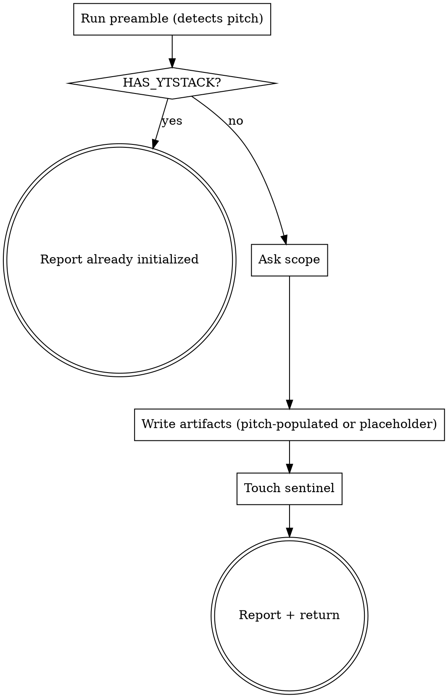

# init-project

Initialize a `.ytstack/` directory with the core project-memory artifacts that every other ytstack skill depends on.

## Anti-Pattern: "This project is too small for formal init"

Every project goes through this. A CSS tweak, a weekend script, a prototype -- all of them. "Small" projects are where unexamined assumptions cause the most wasted work. The init can be minimal (one scope question), but you MUST run it before any other ytstack skill except `office-hours`.

If the user insists the project is too small for ytstack, don't force it. Tell them ytstack is optional. But if they've asked for it, run init properly.

**Infra-only scope (DECISIONS 2026-04-24 "Greenfield-flow reorder"):** init-project does NOT ask for project name or one-liner. Those come from a pitch artifact produced by `ytstack:office-hours` (and optionally stress-tested by `plan-ceo-review` / `plan-eng-review`). If no pitch exists when init-project runs, PROJECT.md is scaffolded with explicit placeholders pointing the user at `office-hours`.

## Checklist

You MUST create a TodoWrite task for each of these items and complete them in order:

1. **Run preamble** -- emit state flags about current project, ytstack status, and pitch-artifact presence
2. **Handle already-initialized case** -- if HAS_YTSTACK=yes, report and exit cleanly
3. **Ask scope question** -- project-level vs user-level storage (core tier)
4. **Create artifact directory** -- `.ytstack/` or `~/.ytstack/projects/<slug>/` based on scope
5. **Write all 6 artifact files** -- PROJECT, DECISIONS, KNOWLEDGE, RUNTIME, STATE, PREFERENCES. PROJECT.md pre-populated from pitch artifact if present; otherwise placeholders.
6. **Touch completion sentinel** -- `~/.ytstack/.init-project-<slug>-completed`
7. **Report what was created** -- file list + pitch-status + next-step suggestion
8. **Return control** -- do NOT auto-invoke any other skill

## Process Flow



## Preamble

Run this first. Output gets read by the procedure below.

```bash
_BRANCH=$(git branch --show-current 2>/dev/null || echo unknown)
_PROJECT_SLUG=$(basename "$(git rev-parse --show-toplevel 2>/dev/null)" 2>/dev/null || basename "$(pwd)")
_HAS_PROJECT_YT=$([ -d .ytstack ] && echo yes || echo no)
_HAS_USER_YT=$([ -d "$HOME/.ytstack/projects/$_PROJECT_SLUG" ] && echo yes || echo no)
if [ "$_HAS_PROJECT_YT" = "yes" ]; then
  _HAS_YTSTACK=yes
  _YTSTACK_SCOPE=project
elif [ "$_HAS_USER_YT" = "yes" ]; then
  _HAS_YTSTACK=yes
  _YTSTACK_SCOPE=user
else
  _HAS_YTSTACK=no
  _YTSTACK_SCOPE=none
fi
_NON_INTERACTIVE=false
if [ -n "$YTSTACK_NON_INTERACTIVE" ] || [ -n "$OPENCLAW_SESSION" ] || [ -n "$CLAUDE_AGENT_TEAM_MEMBER" ]; then
  _NON_INTERACTIVE=true
fi
_EXPLAIN_LEVEL="default"
[ -f "$HOME/.ytstack/config" ] && _EXPLAIN_LEVEL=$(grep -E '^explain_level=' "$HOME/.ytstack/config" 2>/dev/null | cut -d= -f2 || echo default)
_IS_GIT=$([ -d .git ] && echo yes || echo no)
# Pitch-artifact discovery (produced by ytstack:office-hours)
_PITCH=""
if [ -f "./OFFICE-HOURS.md" ]; then
  _PITCH="./OFFICE-HOURS.md"
fi
_PITCH_NAME=""
_PITCH_ONELINER=""
if [ -n "$_PITCH" ]; then
  _PITCH_NAME=$(sed -n 's/^name: *//p' "$_PITCH" | head -1)
  _PITCH_ONELINER=$(sed -n 's/^one-liner: *//p' "$_PITCH" | head -1)
fi
echo "BRANCH: $_BRANCH"
echo "PROJECT_SLUG: $_PROJECT_SLUG"
echo "HAS_YTSTACK: $_HAS_YTSTACK"
echo "YTSTACK_SCOPE: $_YTSTACK_SCOPE"
echo "YTSTACK_NON_INTERACTIVE: $_NON_INTERACTIVE"
echo "EXPLAIN_LEVEL: $_EXPLAIN_LEVEL"
echo "IS_GIT: $_IS_GIT"
echo "PITCH: ${_PITCH:-none}"
echo "PITCH_NAME: ${_PITCH_NAME:-<placeholder>}"
echo "PITCH_ONELINER: ${_PITCH_ONELINER:-<placeholder>}"
```

## Procedure

### Step 2: Handle already-initialized case

If `HAS_YTSTACK` is `yes`, do NOT re-initialize. Report and exit:

> "ytstack is already initialized for `{PROJECT_SLUG}` at {location based on YTSTACK_SCOPE}. To see current state, read `STATE.md` in that directory. To re-init from scratch, delete that directory first and run this skill again."

Do not invoke any other skill. Return control.

### Step 3: Ask scope question

If `YTSTACK_NON_INTERACTIVE` is `true`, auto-pick option A (project-level) and log:

> `[ytstack:init-project] auto-picked A (project-level) because YTSTACK_NON_INTERACTIVE=true`

Otherwise, use AskUserQuestion with this exact body:

> I'm initializing ytstack project tracking for `{PROJECT_SLUG}` on branch `{BRANCH}`. No `.ytstack/` exists yet.
>
> ytstack stores project memory (what you're building, decisions you make, patterns you learn) in a set of files. Every future session reads them first, so Claude doesn't forget context between sessions. Two places this can live:
>
> **Project-level** (`./.ytstack/` in your repo): committed to git, shared with team, survives machine migration. Everyone working on this project sees the same memory.
>
> **User-level** (`~/.ytstack/projects/{PROJECT_SLUG}/`): private, follows you across machines if you sync `~/.ytstack/`, not shared.
>
> RECOMMENDATION: Choose A. Project-level is the only safe default. You never lose state to a laptop failure, and teammates see the same history. User-level is only right for secret side projects or when you can't commit to the repo.
>
> A) Project-level (./.ytstack/) -- committed to git, team-shared
>    Completeness: 10/10, effort: 0 setup / 0 ongoing, tier: core
>
> B) User-level (~/.ytstack/projects/{SLUG}/) -- private, machine-local
>    Completeness: 7/10, effort: 0 setup / 0 ongoing (risk of loss on hardware failure), tier: core
>
> C) Both (project for team facts, user for private notes) -- hybrid
>    Completeness: 9/10, effort: low setup / slight ongoing discipline, tier: core
>
> (to re-ask later: delete `~/.ytstack/.init-project-{SLUG}-scope-prompted`)

Remember the answer as `_SCOPE_CHOICE` (value: `project`, `user`, or `both`).

### Step 4: Create artifact directory

Based on `_SCOPE_CHOICE`:

- If `project` or `both`: `mkdir -p .ytstack`
- If `user` or `both`: `mkdir -p "$HOME/.ytstack/projects/$_PROJECT_SLUG"`

For `both`, write all files to both locations for v0.1. Later skills can split.

If a pitch artifact exists (`PITCH != none` from preamble), also move it into the ytstack dir: `mv ./OFFICE-HOURS.md "$_YT_DIR/OFFICE-HOURS-$_PITCH_SLUG.md"` (slug is a 2-4 word kebab-case summary from the pitch headline; if none available, use `initial`). The pitch is now a ytstack artifact that downstream skills (plan-milestone, plan-ceo-review milestone-mode) can read.

### Step 5: Write 6 artifact files

Use the Write tool. Substitutions:

- `{PROJECT_NAME}` = `$_PITCH_NAME` if non-empty, else `$_PROJECT_SLUG`.
- `{PROJECT_ONELINER}` = `$_PITCH_ONELINER` if non-empty, else the placeholder string `(run /ytstack:office-hours to validate the premise and populate this one-liner; until then the project has no validated pitch)`.
- `{PROJECT_SLUG}` = `$_PROJECT_SLUG`.
- `{ISO_TIMESTAMP}` = current UTC timestamp in `YYYY-MM-DDTHH:MM:SSZ` format.

Location: the directory chosen in Step 4. For `both`, write each file to both locations with identical content.

#### PROJECT.md

```markdown
---
name: {PROJECT_NAME}
slug: {PROJECT_SLUG}
created: {ISO_TIMESTAMP}
updated: {ISO_TIMESTAMP}
---

# {PROJECT_NAME}

**One-liner:** {PROJECT_ONELINER}

## What this project is

(Expand the one-liner. What does it do? What problem does it solve? Who is it for?)

## Why it exists

(What motivated this project? What was broken before?)

## Success criteria

(When will we know this is working? Concrete signals, not abstract goals.)

## Current status

(Short status line. Updated by ytstack:plan-milestone and ytstack:summarize-task.)
```

#### DECISIONS.md

```markdown
# Decisions

Append-only architectural and product decisions for {PROJECT_NAME}. Never rewrite past entries. If a decision is reversed, add a new entry that supersedes.

Format for each entry:

## YYYY-MM-DD: <Short title>

**Context:** <what forced the decision>
**Options considered:** <A, B, C>
**Chose:** <selected option>
**Reason:** <why>
**Supersedes:** <link to earlier entry if this reverses a prior decision>
```

#### KNOWLEDGE.md

```markdown
# Knowledge

Patterns, rules, and lessons learned while building {PROJECT_NAME}. This file is read by every future session. Keep it short. Keep it actionable.

## Conventions

(Code style, file layout, naming rules that apply across the project.)

## Lessons learned

(Non-obvious things discovered during development. Each entry: one-line lesson + short context.)

## Gotchas

(Things that would surprise a new contributor or agent.)
```

#### RUNTIME.md

```markdown
# Runtime

Services, APIs, env vars, and ports used by {PROJECT_NAME}.

## Services

(External services this project depends on. Name, URL, purpose.)

## Environment variables

(Required env vars. Name, purpose, example value.)

## Ports

(Ports this project listens on or connects to.)

## Deploy target

(Where this deploys to, if applicable.)
```

#### STATE.md

```markdown
---
project: {PROJECT_NAME}
slug: {PROJECT_SLUG}
last_updated: {ISO_TIMESTAMP}
current_milestone: none
active_slice: none
active_task: none
---

# State

**Status:** initialized, no milestone yet

## Next action

Run `ytstack:plan-milestone` to define the first milestone.

## Open decisions

(Pending decisions the user needs to make. Updated by skills when they hit a gate.)

## Recent summaries

(Latest 3 T##-SUMMARY.md entries will appear here.)
```

#### PREFERENCES.md

```markdown
# Preferences

Local preferences for {PROJECT_NAME}. These apply to every ytstack session for this project.

## Explain level

explain_level: default

Options: default | terse | brutal

## Model preferences

(Fill in preferred model for each skill type if non-default.)

## Timeouts

(Override defaults here.)

## Custom

(Project-specific preferences that don't fit elsewhere.)
```

### Step 6: Touch completion sentinel

```bash
mkdir -p "$HOME/.ytstack"
touch "$HOME/.ytstack/.init-project-${_PROJECT_SLUG}-completed"
touch "$HOME/.ytstack/.init-project-${_PROJECT_SLUG}-scope-prompted"
```

### Step 7: Report what was created

Write this prose summary (substitute the real paths based on `_SCOPE_CHOICE`, and branch on whether a pitch was consumed):

**If `PITCH != none`** (pitch was consumed + moved to ytstack dir):

> Created ytstack tracking for **{PROJECT_NAME}**:
>
> - {location}/PROJECT.md -- populated from `OFFICE-HOURS-{PITCH_SLUG}.md`
> - {location}/OFFICE-HOURS-{PITCH_SLUG}.md -- the validated pitch (moved from `./OFFICE-HOURS.md`)
> - {location}/DECISIONS.md -- empty decision register (append as you decide)
> - {location}/KNOWLEDGE.md -- empty patterns and lessons file
> - {location}/RUNTIME.md -- empty services and env-vars file
> - {location}/STATE.md -- dashboard, current status
> - {location}/PREFERENCES.md -- your local settings
>
> Next step: run `ytstack:plan-milestone` to define the first milestone. The pitch gives plan-milestone a goal and exit criteria to draw from.
>
> If you're in a git repo (`IS_GIT: yes`): these files are unstaged. `git status` will show them. Commit when ready.

**If `PITCH = none`** (no pitch, placeholders were written):

> Created ytstack tracking for **{PROJECT_NAME}** (scaffolded without a validated pitch):
>
> - {location}/PROJECT.md -- one-liner is a placeholder pointing to office-hours
> - {location}/DECISIONS.md, KNOWLEDGE.md, RUNTIME.md, STATE.md, PREFERENCES.md -- empty
>
> **Recommended next step: run `ytstack:office-hours`** to validate the project premise, then the outcome will populate PROJECT.md. Running `ytstack:plan-milestone` directly without a pitch works but the milestone goal will not be grounded in a validated premise.
>
> If you're in a git repo (`IS_GIT: yes`): these files are unstaged. `git status` will show them. Commit when ready.

### Step 8: Return control

STOP here. Do NOT invoke `ytstack:plan-milestone` or `ytstack:office-hours` automatically. The user decides the next step.

## Terminal State

The terminal state is one of:

- Returning control to the user after writing the 6 artifacts and reporting file paths
- Exiting immediately after reporting "already initialized" (when HAS_YTSTACK=yes)

Do NOT invoke `ytstack:plan-milestone`, `ytstack:office-hours`, `ytstack:spawn-milestone-team`, or any other ytstack skill from here. The ONLY valid next actions are:

- User reviews and edits PROJECT.md manually
- User runs `ytstack:office-hours` if no pitch was consumed (PROJECT.md has placeholder one-liner)
- User runs `ytstack:plan-milestone` when ready for the first milestone
