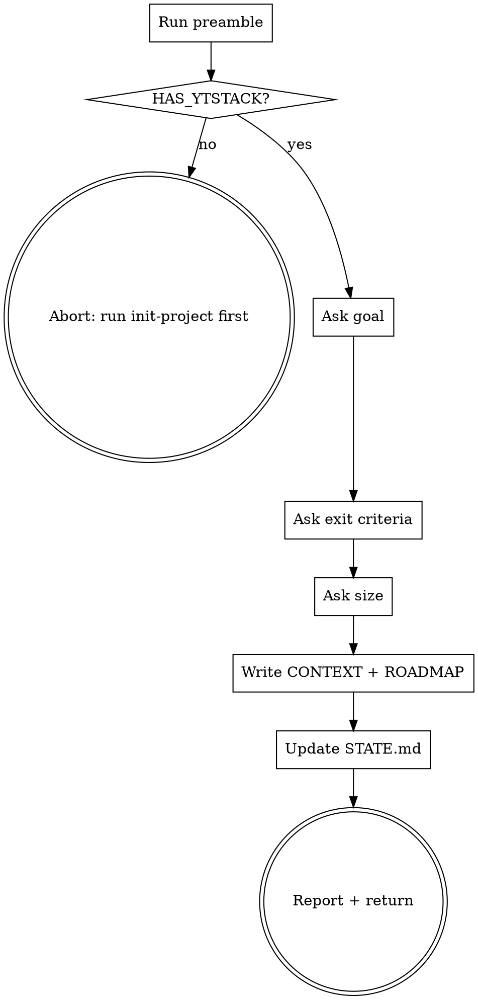

# plan-milestone

Define the next milestone for a ytstack project: goal, exit criteria, rough size. Produces a milestone roadmap skeleton; slice-level detail comes from the next skill (`slice-milestone`).

## Anti-Pattern: "This feature is too small for a milestone"

Every feature goes through this. A CSS tweak, a single bugfix, a config change -- all of them. "Small" features are where unexamined assumptions cause the most wasted work. The milestone can be minimal (one slice, two tasks), but you MUST define its goal, exit criteria, and rough shape before planning slices.

## Checklist

You MUST create a TodoWrite task for each of these items and complete them in order:

1. **Run preamble** -- detect ytstack state + next milestone number
2. **HARD-GATE: check ytstack initialized** -- abort if `HAS_YTSTACK=no`
3. **Ask goal** -- one-sentence outcome the milestone delivers
4. **Ask exit criteria** -- how we know it's done (concrete signals)
5. **Ask rough size** -- S / M / L (cascading from task-count estimate)
6. **Write `M###-CONTEXT.md`** -- Q/A transcript locked as the milestone's source-of-truth
7. **Write `M###-ROADMAP.md`** -- skeleton with placeholder slices based on size
8. **Update STATE.md** -- new `current_milestone`, next action points to slice-milestone
9. **Report + return** -- suggest running `ytstack:slice-milestone` next

## Process Flow



## Preamble

```bash
_PROJECT_DIR="${CLAUDE_PROJECT_DIR:-$PWD}"
cd "$_PROJECT_DIR" 2>/dev/null || true
_BRANCH=$(git branch --show-current 2>/dev/null || echo unknown)
_PROJECT_SLUG=$(basename "$(git rev-parse --show-toplevel 2>/dev/null)" 2>/dev/null || basename "$(pwd)")

# Resolve ytstack dir
if [ -d "$_PROJECT_DIR/.ytstack" ]; then
  _YT_DIR="$_PROJECT_DIR/.ytstack"
  _YT_SCOPE=project
elif [ -d "$HOME/.ytstack/projects/$_PROJECT_SLUG" ]; then
  _YT_DIR="$HOME/.ytstack/projects/$_PROJECT_SLUG"
  _YT_SCOPE=user
else
  _YT_DIR=""
  _YT_SCOPE=none
fi

_HAS_YTSTACK=$([ -n "$_YT_DIR" ] && echo yes || echo no)

# Next milestone number
_NEXT_MILESTONE="M001"
if [ -n "$_YT_DIR" ]; then
  _MAX=$(ls "$_YT_DIR"/M[0-9][0-9][0-9]-*.md 2>/dev/null | sed -E 's/.*M([0-9]{3})-.*/\1/' | sort -u | tail -1)
  if [ -n "$_MAX" ]; then
    _NEXT_MILESTONE=$(printf "M%03d" $((10#$_MAX + 1)))
  fi
fi

# Project-level frontmatter
_PROJECT_NAME=""
if [ -f "$_YT_DIR/PROJECT.md" ]; then
  _PROJECT_NAME=$(sed -n 's/^name: *//p' "$_YT_DIR/PROJECT.md" | head -1)
fi

_NON_INTERACTIVE=false
if [ -n "$YTSTACK_NON_INTERACTIVE" ] || [ -n "$OPENCLAW_SESSION" ] || [ -n "$CLAUDE_AGENT_TEAM_MEMBER" ]; then
  _NON_INTERACTIVE=true
fi

echo "BRANCH: $_BRANCH"
echo "PROJECT_SLUG: $_PROJECT_SLUG"
echo "PROJECT_NAME: $_PROJECT_NAME"
echo "YT_DIR: $_YT_DIR"
echo "YT_SCOPE: $_YT_SCOPE"
echo "HAS_YTSTACK: $_HAS_YTSTACK"
echo "NEXT_MILESTONE: $_NEXT_MILESTONE"
echo "YTSTACK_NON_INTERACTIVE: $_NON_INTERACTIVE"
```

## Procedure

### Step 2: HARD-GATE

If `HAS_YTSTACK` is `no`:

> "ytstack isn't initialized in this project yet. Run `/ytstack:init-project` first, then return here to plan the first milestone."

STOP. Do not invoke any other skill automatically.

### Step 3: Ask goal

If `YTSTACK_NON_INTERACTIVE` is `true`, parse goal from prompt context. Otherwise use AskUserQuestion (open-ended):

> Planning milestone **{NEXT_MILESTONE}** for project **{PROJECT_NAME}** on branch `{BRANCH}`.
>
> What's the goal of this milestone? One sentence describing the outcome it delivers. Not the tasks -- the *result*.
>
> Good examples:
> - "Users can sign up with email and get a verification link."
> - "Deploy a staging environment that mirrors prod config."
> - "Ship a CLI subcommand that imports CSV exports."

Remember as `_GOAL`.

### Step 4: Ask exit criteria

Use AskUserQuestion (open-ended):

> How will we know this milestone is done? List the concrete signals.
>
> Concrete > abstract. "Signup form posts to /api/signup and returns 201" beats "signup works".
>
> Give 2-4 checkable items, one per line.

Remember as `_EXIT_CRITERIA` (preserve line breaks).

### Step 5: Ask rough size

If `YTSTACK_NON_INTERACTIVE` is `true`, auto-pick M (medium) and log. Otherwise use AskUserQuestion:

> Rough size of this milestone? Use your gut -- we'll refine in slice-milestone.
>
> Size drives the initial slice skeleton. You can always add slices later.
>
> RECOMMENDATION: Choose M for most milestones. S is for near-trivial features. L signals you should probably split into two milestones; review after slicing.
>
> A) S -- small. 1 slice, 2-4 tasks total. (Completeness: 10/10 for truly small work, risk: 8/10 if the scope is actually larger than it feels)
> B) M -- medium. 2-3 slices, 5-10 tasks total. (Completeness: 10/10, recommended for most milestones)
> C) L -- large. 4-5 slices, 11-20 tasks total. (Completeness: 10/10, risk: consider splitting into two milestones)
>
> (to re-ask later: delete `~/.ytstack/.milestone-size-{NEXT_MILESTONE}-prompted`)

Remember as `_SIZE` (value: `S`, `M`, or `L`).

### Step 6: Write `M###-CONTEXT.md`

Use Write tool. Path: `{YT_DIR}/{NEXT_MILESTONE}-CONTEXT.md`.

```markdown
---
milestone: {NEXT_MILESTONE}
project: {PROJECT_NAME}
created: {ISO_TIMESTAMP}
size: {SIZE}
---

# {NEXT_MILESTONE} -- Context

## Goal

{GOAL}

## Exit criteria

{EXIT_CRITERIA}

## Size

{SIZE} -- see `{NEXT_MILESTONE}-ROADMAP.md` for slice breakdown.

## Decisions locked in discuss phase

(Append decisions here as they're made during slicing + execution. Format: "YYYY-MM-DD: decided X because Y.")

## Open questions

(Items to resolve before or during slicing. Close as decisions land in the list above.)
```

### Step 7: Write `M###-ROADMAP.md`

Use Write tool. Path: `{YT_DIR}/{NEXT_MILESTONE}-ROADMAP.md`.

Slice-count based on size: S=1, M=2-3, L=4-5. For v0.1, always seed the lower bound (S=1, M=2, L=4). User can add more during `slice-milestone`.

Template (substitute slice placeholders based on size):

```markdown
---
milestone: {NEXT_MILESTONE}
project: {PROJECT_NAME}
size: {SIZE}
created: {ISO_TIMESTAMP}
status: planned
total_slices: {SLICE_COUNT}
completed_slices: 0
---

# {NEXT_MILESTONE} Roadmap

**Goal:** {GOAL}

**Exit criteria:**
{EXIT_CRITERIA}

## Slices

Slice detail lives in per-slice `{NEXT_MILESTONE}-S##-PLAN.md` files, created by `ytstack:slice-milestone`.

- [ ] S01 -- (to be planned)
{#if SIZE == "M" or SIZE == "L"}
- [ ] S02 -- (to be planned)
- [ ] S03 -- (to be planned)
{/if}
{#if SIZE == "L"}
- [ ] S04 -- (to be planned)
{/if}

## Run order

Slices execute sequentially. After each slice, `ytstack:reassess-roadmap` checks if the plan still fits reality.

## How to update this file

- Flip slice checkbox `[ ]` → `[x]` when its tasks are all `summarize-task`-confirmed
- Update `completed_slices` count
- On milestone completion, flip `status: planned` → `status: done` and update global ROADMAP.md
```

Replace the `{#if ...}` blocks with actual lines based on `_SIZE`:
- S → keep only S01
- M → S01, S02, S03
- L → S01, S02, S03, S04

### Step 8: Update STATE.md

Use Edit tool on `{YT_DIR}/STATE.md`. Change:

- `current_milestone: <old value>` → `current_milestone: {NEXT_MILESTONE}`
- `active_slice: <old>` → `active_slice: none`
- `active_task: <old>` → `active_task: none`
- `last_updated: <old>` → `last_updated: {ISO_TIMESTAMP}`

Also update the `# State` body:
- Status line → `**Status:** {NEXT_MILESTONE} planned ({SIZE}). Ready to slice.`
- Next action → `Run \`ytstack:slice-milestone\` to break {NEXT_MILESTONE} into concrete slices and tasks.`

### Step 9: Report + return

Report:

> Milestone **{NEXT_MILESTONE}** planned ({SIZE}):
>
> - Goal: {GOAL}
> - Exit criteria: {EXIT_CRITERIA_FIRST_LINE} ...
> - Slices: {SLICE_COUNT} placeholder(s) in `{NEXT_MILESTONE}-ROADMAP.md`
>
> Files created:
> - `{YT_DIR}/{NEXT_MILESTONE}-CONTEXT.md` -- Q/A locked
> - `{YT_DIR}/{NEXT_MILESTONE}-ROADMAP.md` -- slice skeleton
>
> STATE.md updated: `current_milestone` = {NEXT_MILESTONE}.
>
> Next step: run `/ytstack:slice-milestone` to define the slices in detail.

## Terminal State

The terminal state is one of:

- Returning control after writing M###-CONTEXT.md + M###-ROADMAP.md + updating STATE.md
- Aborting if HAS_YTSTACK=no (with clear message to run init-project first)

Do NOT invoke `ytstack:slice-milestone`, `ytstack:plan-task`, or any other downstream skill automatically. The ONLY valid next actions are:

- User reviews the generated files
- User runs `/ytstack:slice-milestone` themselves when ready
