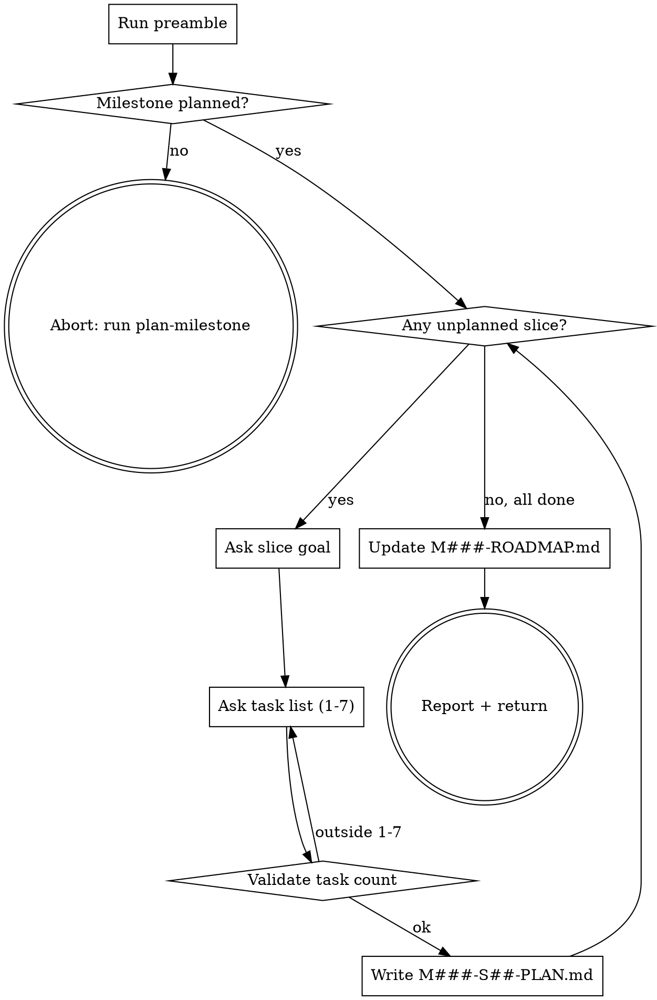

# slice-milestone

Break an existing milestone into concrete slices. Each slice gets a goal + 1-7 tasks. Writes one `M###-S##-PLAN.md` per slice.

## Anti-Pattern: "I'll just plan one big slice with 15 tasks"

No. 1-7 tasks per slice is the iron rule. Larger slices lose context fidelity during execution -- the agent forgets the early tasks by the time it reaches the late ones. If you feel you need >7 tasks in one slice, split into two. That's not arbitrary -- it's the structural constraint that makes subagent-driven execution work.

## Checklist

You MUST create a TodoWrite task for each of these items and complete them in order:

1. **Run preamble** -- detect current milestone + unplanned slice slots
2. **HARD-GATE: milestone must be planned** -- abort if `CURRENT_MILESTONE=none`
3. **Loop per unplanned slice:** ask goal, ask task list (1-7 items), write `M###-S##-PLAN.md`
4. **Update `M###-ROADMAP.md`** -- replace slice placeholders with real names
5. **Report + return** -- next step is `plan-task` or `spawn-milestone-team` (M006)

## Process Flow



## Preamble

```bash
_PROJECT_DIR="${CLAUDE_PROJECT_DIR:-$PWD}"
cd "$_PROJECT_DIR" 2>/dev/null || true
_PROJECT_SLUG=$(basename "$(git rev-parse --show-toplevel 2>/dev/null)" 2>/dev/null || basename "$(pwd)")

if [ -d "$_PROJECT_DIR/.ytstack" ]; then
  _YT_DIR="$_PROJECT_DIR/.ytstack"
elif [ -d "$HOME/.ytstack/projects/$_PROJECT_SLUG" ]; then
  _YT_DIR="$HOME/.ytstack/projects/$_PROJECT_SLUG"
else
  _YT_DIR=""
fi

_HAS_YTSTACK=$([ -n "$_YT_DIR" ] && echo yes || echo no)

_CURRENT_MILESTONE=none
if [ -f "$_YT_DIR/STATE.md" ]; then
  _CURRENT_MILESTONE=$(sed -n 's/^current_milestone: *//p' "$_YT_DIR/STATE.md" | head -1)
fi

_ROADMAP="$_YT_DIR/$_CURRENT_MILESTONE-ROADMAP.md"
_UNPLANNED_SLICES=""
if [ -f "$_ROADMAP" ]; then
  _UNPLANNED_SLICES=$(grep -oE 'S[0-9][0-9] -- \(to be planned\)' "$_ROADMAP" | grep -oE 'S[0-9][0-9]' | tr '\n' ' ')
fi

_NON_INTERACTIVE=false
if [ -n "$YTSTACK_NON_INTERACTIVE" ] || [ -n "$OPENCLAW_SESSION" ] || [ -n "$CLAUDE_AGENT_TEAM_MEMBER" ]; then
  _NON_INTERACTIVE=true
fi

echo "HAS_YTSTACK: $_HAS_YTSTACK"
echo "CURRENT_MILESTONE: $_CURRENT_MILESTONE"
echo "ROADMAP: $_ROADMAP"
echo "UNPLANNED_SLICES: ${_UNPLANNED_SLICES:-none}"
echo "YTSTACK_NON_INTERACTIVE: $_NON_INTERACTIVE"
```

## Procedure

### Step 2: HARD-GATE

If `HAS_YTSTACK` is `no`:
> "ytstack isn't initialized here. Run `/ytstack:init-project` first."
STOP.

If `CURRENT_MILESTONE` is `none` or the `M###-ROADMAP.md` file does not exist:
> "No milestone is currently planned. Run `/ytstack:plan-milestone` first."
STOP.

If `UNPLANNED_SLICES` is empty:
> "All slices in `{CURRENT_MILESTONE}` are already planned. Re-running this skill does nothing until a new slice placeholder exists in `{CURRENT_MILESTONE}-ROADMAP.md`."
STOP.

### Step 3: Loop per unplanned slice

For each `S##` in `UNPLANNED_SLICES`:

**3a -- Ask slice goal.** Use AskUserQuestion (open-ended):

> Slice **{CURRENT_MILESTONE}-{SLICE_ID}** of **{CURRENT_MILESTONE_GOAL}**.
>
> What's the goal of this slice? One sentence. The slice should produce working, testable software on its own -- not a half-feature that requires later slices to verify.
>
> Good examples:
> - "Signup form validates email and creates a user row."
> - "CLI accepts --input and --output flags and writes to the target file."
> - "CI workflow runs the test suite on every push to main."

Remember as `_SLICE_GOAL`.

**3b -- Ask task list.** Use AskUserQuestion (open-ended):

> List the 1-7 tasks that complete this slice. One task per line. Each task should:
> - Fit in one context window (iron rule from ytstack docs)
> - Produce a testable, revertable change
> - Have an obvious "done" signal
>
> Good example (3 tasks for a signup slice):
> - Add email field to signup form with client-side regex validation
> - POST /api/signup validates server-side, hashes password, inserts user row
> - Integration test: form submission creates a user and returns 201

Remember as `_SLICE_TASKS` (preserve lines).

**3c -- Validate task count.** Count lines in `_SLICE_TASKS`. If count is 0 or >7:
> "I count {N} tasks. The iron rule is 1-7 per slice. Re-list with the right count, or split this into two slices by re-running `plan-milestone` to add a slice placeholder first."

Loop back to 3b.

**3d -- Write `M###-S##-PLAN.md`.** Use Write tool:

```markdown
---
milestone: {CURRENT_MILESTONE}
slice: {SLICE_ID}
project: {PROJECT_NAME}
created: {ISO_TIMESTAMP}
status: planned
task_count: {N}
completed_tasks: 0
---

# {CURRENT_MILESTONE}-{SLICE_ID} -- Slice Plan

**Goal:** {SLICE_GOAL}

## Tasks

{For each task in _SLICE_TASKS, emit:}

- [ ] T{##} -- {task-line}

## Done when

All tasks marked `[x]` and verified via `ytstack:summarize-task`.

## Notes

(Add observations during slice execution. Issues that surface become entries in `DECISIONS.md` or `KNOWLEDGE.md`.)
```

Task numbering: T01, T02, T03, ... in order provided. Zero-pad to 2 digits.

### Step 4: Update `M###-ROADMAP.md`

Use Edit tool. For each slice planned above, replace:

```
- [ ] S## -- (to be planned)
```

with:

```
- [ ] S## -- {SLICE_GOAL_FIRST_LINE}
```

Keep the `[ ]` checkbox (not yet executed, just planned).

### Step 5: Report + return

Report:

> Sliced **{CURRENT_MILESTONE}** ({COUNT_PLANNED} of {TOTAL_SLICES} slices now planned):
>
> {For each slice:}
> - {SLICE_ID}: {SLICE_GOAL} ({N_TASKS} tasks) -- `{CURRENT_MILESTONE}-{SLICE_ID}-PLAN.md`
>
> {CURRENT_MILESTONE}-ROADMAP.md updated with slice names.
>
> Next step options:
> - Run `/ytstack:plan-task` to flesh out the first task of slice S01 with file paths + verification steps.
> - Run `/ytstack:spawn-milestone-team` (ships M006) to dispatch the whole milestone to an Agent Team.
> - Add more slices by editing `{CURRENT_MILESTONE}-ROADMAP.md` to add new `- [ ] S## -- (to be planned)` lines and re-running this skill.

## Terminal State

The terminal state is:

- Returning control after writing 1+ `M###-S##-PLAN.md` files and updating `M###-ROADMAP.md`
- Aborting early if HAS_YTSTACK=no, CURRENT_MILESTONE=none, or no unplanned slices remain

Do NOT invoke `ytstack:plan-task` or `ytstack:spawn-milestone-team` automatically. The ONLY valid next actions are:

- User reviews generated slice-plan files
- User runs one of the suggested next-step skills when ready
