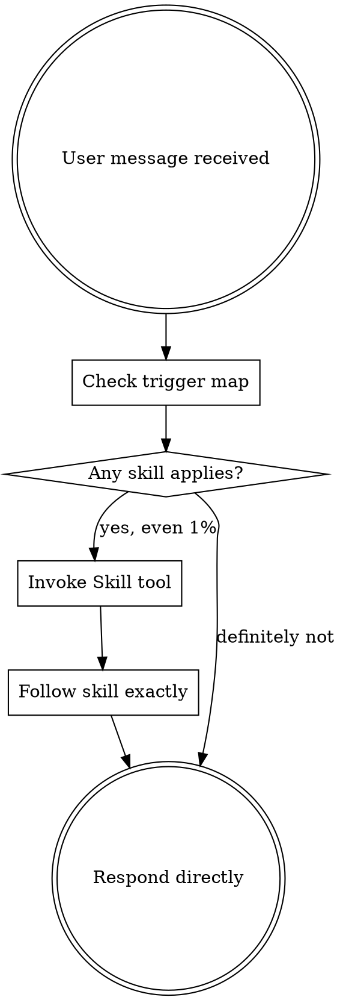

# Using ytstack

<SUBAGENT-STOP>
If you were dispatched as an Agent Teams teammate to execute a specific slice or task, skip this skill -- your scope is bounded by the task plan the lead gave you.
</SUBAGENT-STOP>

<EXTREMELY-IMPORTANT>
This project uses ytstack. A `.ytstack/` directory is present and a hook has injected project state into your context. You MUST use the ytstack skills to drive work, not ad-hoc behavior.

If you think there is even a 1% chance a ytstack skill applies to what the user asked, you ABSOLUTELY MUST invoke the skill via the `Skill` tool BEFORE any other action.

IF A YTSTACK SKILL APPLIES, YOU DO NOT HAVE A CHOICE. USE IT.

This is not negotiable. This is not optional. You cannot rationalize your way out of this.
</EXTREMELY-IMPORTANT>

## Instruction priority

User instructions always take precedence over skills:

1. **User's explicit instructions** (`CLAUDE.md`, direct messages, `--append-system-prompt`) -- highest priority. If the user says "don't run the milestone workflow, just make this one change", honor that.
2. **ytstack skills** -- override default agent behavior when they apply.
3. **Default agent behavior** -- lowest priority.

If `CLAUDE.md` says "skip ytstack for hot-fix branches" and this is a hot-fix branch, don't invoke ytstack skills. The user is in control.

## The rule

**Invoke the relevant ytstack skill BEFORE any response or action.** Even a 1% chance a skill might apply means you should invoke it to check. If the invoked skill turns out to be the wrong fit, you don't have to continue using it -- but you need to check.

## Trigger map

Match the user's message against these phrases and invoke the corresponding skill:

| User says / situation | Skill to invoke |
|---|---|
| "init ytstack", "set up tracking", "new project" (and `.ytstack/` missing) | `ytstack:init-project` |
| "plan a milestone", "new milestone", "start next milestone" | `ytstack:plan-milestone` |
| "break this into slices", "slice this milestone" (milestone planned) | `ytstack:slice-milestone` |
| "next task", "what should I work on", "detail the next step" | `ytstack:plan-task` |
| "task is done", "ship it", "I'm done", "close this out" | `ytstack:summarize-task` |
| "where were we", "resume", "pick up where I left off", "what's open" | `ytstack:resume-session` |
| "handoff", "pause work", "save state for later", "I'm stepping away" | `ytstack:handoff-session` |
| "reassess", "is the plan still right", "review progress" (post-slice) | `ytstack:reassess-roadmap` |
| "think bigger", "expand scope", "CEO review", "challenge premises" | `ytstack:plan-ceo-review` |
| "is this worth building", "brainstorm this", "I have an idea", "office hours" | `ytstack:office-hours` |
| "review architecture", "lock in the plan", "engineering review" | `ytstack:plan-eng-review` |
| "let's TDD this", "write a test first", "RED-GREEN-REFACTOR" | `ytstack:test-driven-development` |
| "debug this", "why is X broken", "investigate", "root cause", "something's off" | `ytstack:systematic-debugging` |
| "verify", "is it really done", "check before I commit" | `ytstack:verification-before-completion` |
| "spawn team", "run slices in parallel", "dispatch milestone" | `ytstack:spawn-milestone-team` |

## Skill priority (when multiple could apply)

1. **Process skills first** (decision-making: office-hours, plan-ceo-review). They determine whether to build at all.
2. **Structural skills next** (plan-milestone, slice-milestone, plan-task). They determine what to build.
3. **Execution skills last** (TDD, systematic-debugging, verification). They determine how to build.

"Let's build X" → `office-hours` or `plan-ceo-review` first (if scope unclear), then `plan-milestone`, then implementation.

"Fix this bug" → `systematic-debugging` first (root-cause it), then task-level skills.

## Red flags -- stop and invoke

These thoughts mean STOP, you're rationalizing:

| Thought | Reality |
|---|---|
| "This is just a simple question" | Questions are tasks. Check for skills. |
| "I already know what they want" | Invoke the skill to be sure. |
| "Skills are overkill for this" | ytstack's skills handle simple cases fast. Use them. |
| "I'll just fix it directly" | Direct fixes bypass verification and scope checks. Use the skills. |
| "This doesn't count as a ytstack thing" | `.ytstack/` is present. It counts. |
| "The plan is obvious" | Plans feel obvious until you write them down and see the gaps. Use `plan-task`. |
| "Let me read the files first" | Skills tell you which files to read. Check for the skill first. |
| "I'll figure it out as I go" | ytstack exists because "figure it out" loses context across sessions. |

## When NOT to invoke a ytstack skill

- User explicitly says "skip ytstack" or "just do it directly"
- Task is clearly outside scope (e.g. fixing a typo in a file that's not in any task-plan -- but consider: is this user bypassing `/ytstack:plan-task` they should run?)
- You're an Agent-Teams subagent with a specific task assignment (SUBAGENT-STOP above)
- The session isn't actually in a ytstack project (no `.ytstack/` -- then this skill's content wouldn't be injected anyway)

## Slash commands -- when the user uses them

The user CAN invoke ytstack skills manually with `/ytstack:<skill-name>`. When they do, honor that explicit choice. But most of the time the user won't type slash commands -- they'll describe what they want in natural language. Your job: map their description to the right skill from the trigger map above, and invoke it.

Slash commands are the user's **steering mechanism** for the non-happy path (override the skill the agent would have picked, skip a step, start an unusual workflow). Normal interaction is natural language, with the agent auto-reaching for skills.

## Process flow (what happens on every user message)

## After invoking a skill

Follow its Checklist exactly. Create TodoWrite entries per item. Don't improvise steps. The skill's Terminal State section tells you what to do next -- respect it; don't auto-invoke the suggested follow-up skill unless explicitly told the user wants that.

## Summary

ytstack is active in this project. Use ytstack skills. When the user describes what they want, map to a skill and invoke. Let the user steer via slash-commands only when they want to override your choice or skip a step. The agent is the one who proactively reaches for skills -- not the user.
