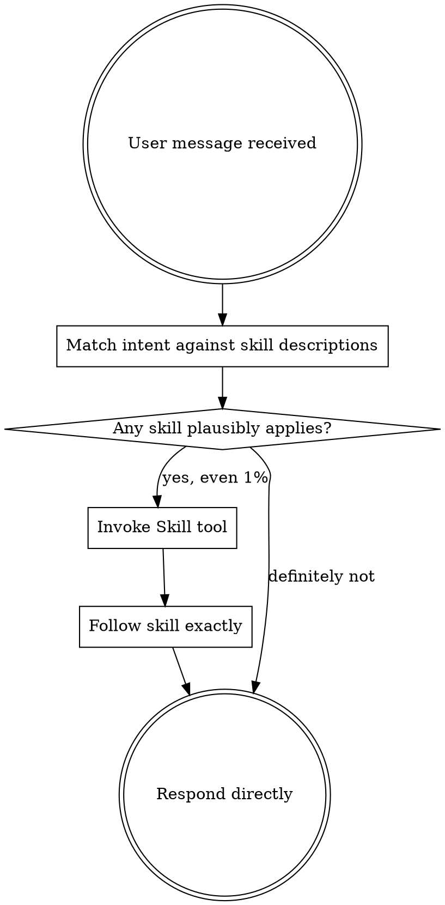

# Using ytstack

<SUBAGENT-STOP>
If you were dispatched as an Agent Teams teammate to execute a specific slice or task, skip this skill -- your scope is bounded by the task plan the lead gave you.
</SUBAGENT-STOP>

<EXTREMELY-IMPORTANT>
This project uses ytstack. A hook has injected project state into your context and you have access to ytstack's skills via the `Skill` tool.

If you think there is even a 1% chance a ytstack skill applies to what the user asked, you ABSOLUTELY MUST invoke the skill via the `Skill` tool BEFORE any other action.

IF A YTSTACK SKILL APPLIES, YOU DO NOT HAVE A CHOICE. USE IT.

This is not negotiable. This is not optional. You cannot rationalize your way out of this.
</EXTREMELY-IMPORTANT>

## Instruction priority

User instructions always take precedence:

1. **User's explicit instructions** (`CLAUDE.md`, direct messages) -- highest priority. If the user says "skip ytstack for this change", honor it.
2. **ytstack skills** -- override default agent behavior when they apply.
3. **Default agent behavior** -- lowest priority.

## The rule

**Invoke the relevant ytstack skill BEFORE any response or action.** Each skill's frontmatter `description` field states when to use it. Match the user's intent against the descriptions semantically -- not against keyword lists or canonical phrasings. If any skill's description plausibly covers the situation, invoke it via the `Skill` tool to confirm. If the invoked skill turns out to be the wrong fit, that is fine; what is NOT fine is skipping the check.

Skills you might need (consult each skill's description, not this list, for the actual when-to-use):

- Project lifecycle: `init-project`, `plan-milestone`, `slice-milestone`, `plan-task`, `summarize-task`, `reassess-roadmap`
- Session continuity: `handoff-session`, `resume-session`
- Planning reviews: `office-hours`, `plan-ceo-review`, `plan-eng-review`
- Execution discipline: `test-driven-development`, `systematic-debugging`, `verification-before-completion`
- Orchestration: `spawn-milestone-team`

The selection mechanism is **semantic, not phrase-based**. New user phrasings (different language, paraphrase, domain-specific vocabulary) should still trigger the right skill as long as the intent is covered by a description.

## Skill priority (when multiple could apply)

1. **Process skills first** (office-hours, plan-ceo-review, systematic-debugging). They determine whether / how to proceed.
2. **Structural skills next** (plan-milestone, slice-milestone, plan-task). They determine what to build.
3. **Execution skills last** (TDD, verification). They determine how to build.

"Let's build X" (greenfield, no pitch yet) -> `office-hours` first. "Fix this bug" -> `systematic-debugging` first.

## Red flags -- stop and invoke

These thoughts mean STOP, you're rationalizing:

| Thought | Reality |
|---|---|
| "This is just a simple question" | Questions are tasks. Check for skills. |
| "I already know what they want" | Invoke the skill to be sure. |
| "Skills are overkill for this" | ytstack's skills handle simple cases fast. Use them. |
| "I'll just fix it directly" | Direct fixes bypass verification + scope checks. Use the skills. |
| "The plan is obvious" | Plans feel obvious until you write them down. Use `plan-task`. |
| "Let me read the files first" | Skills tell you which files to read. Check first. |
| "I'll figure it out as I go" | ytstack exists because "figure it out" loses context across sessions. |

## Process flow (what happens on every user message)

## After invoking a skill

Follow its Checklist exactly. Create TodoWrite entries per item. Don't improvise steps. The skill's Terminal State section tells you what to do next -- respect it; don't auto-invoke the suggested follow-up skill unless the user explicitly asks for it.

## Summary

ytstack is active. Each skill's `description` field is the source of truth for when to invoke it. Match semantically, invoke proactively, follow the skill's checklist exactly, never auto-chain.
